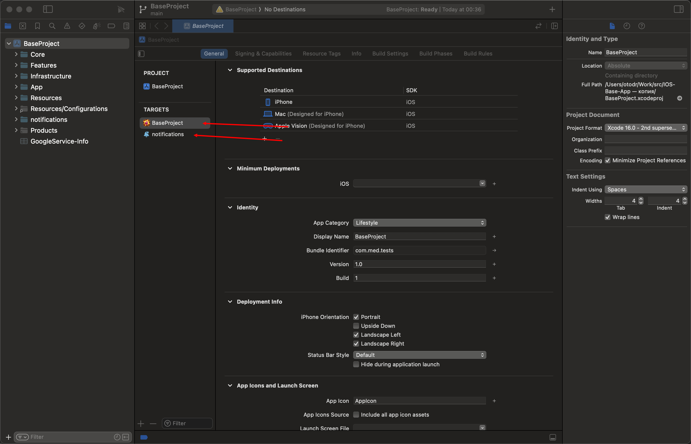
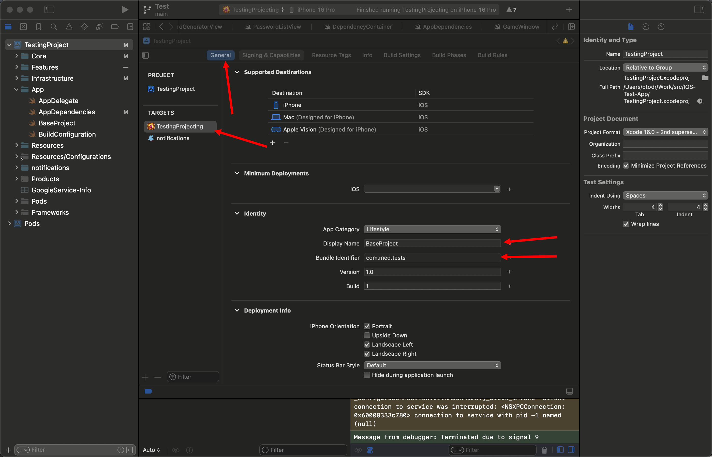
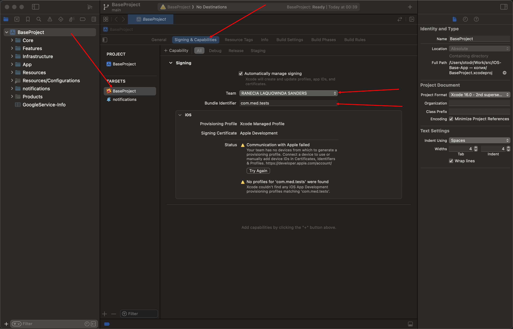
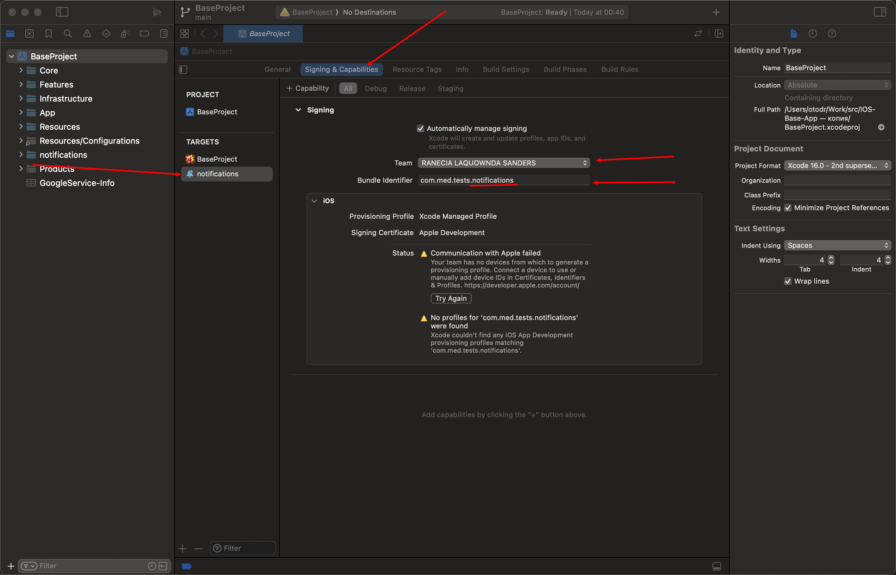
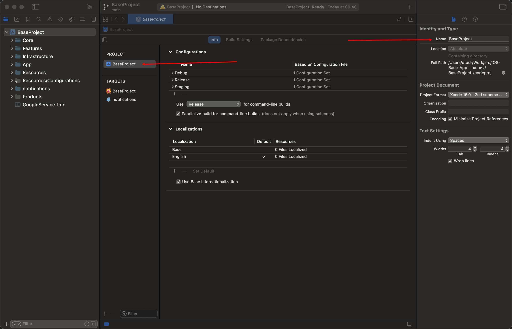
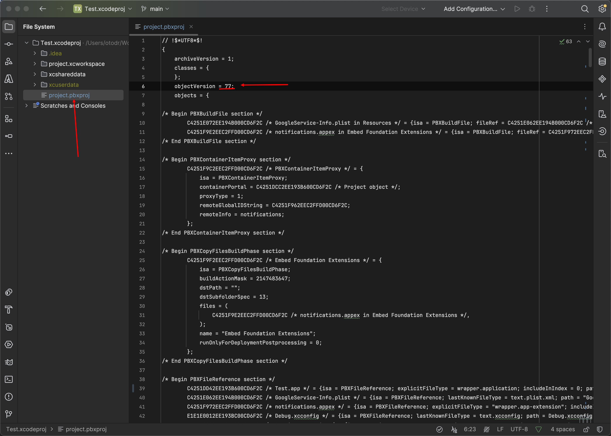
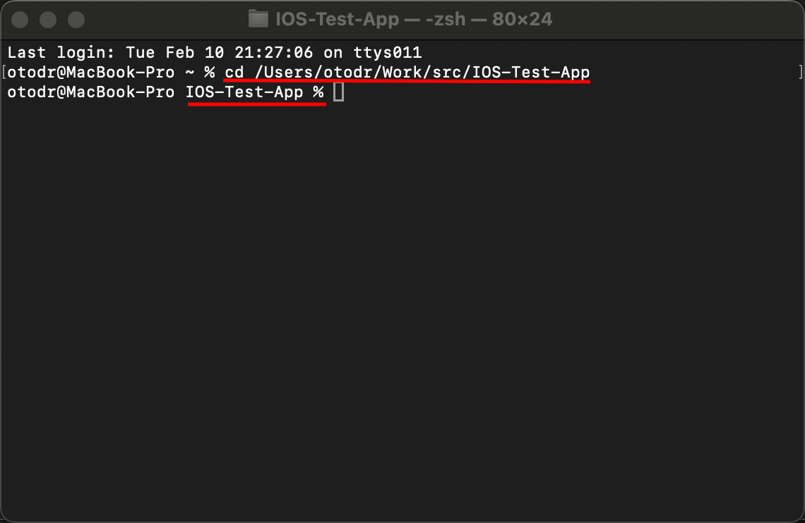
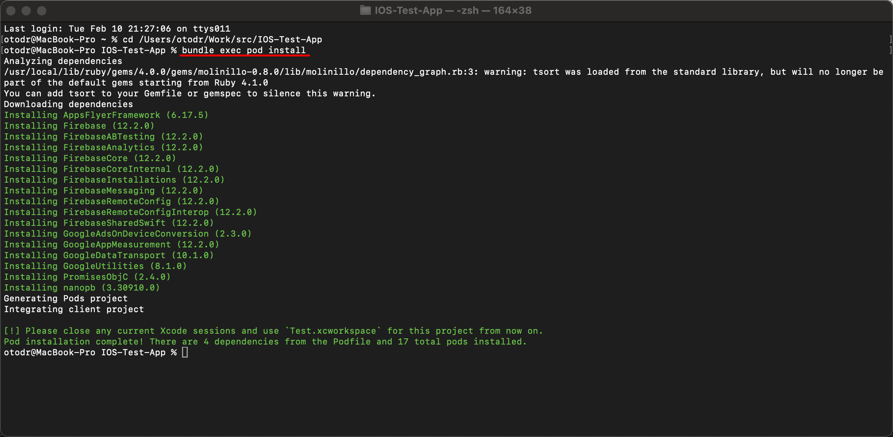
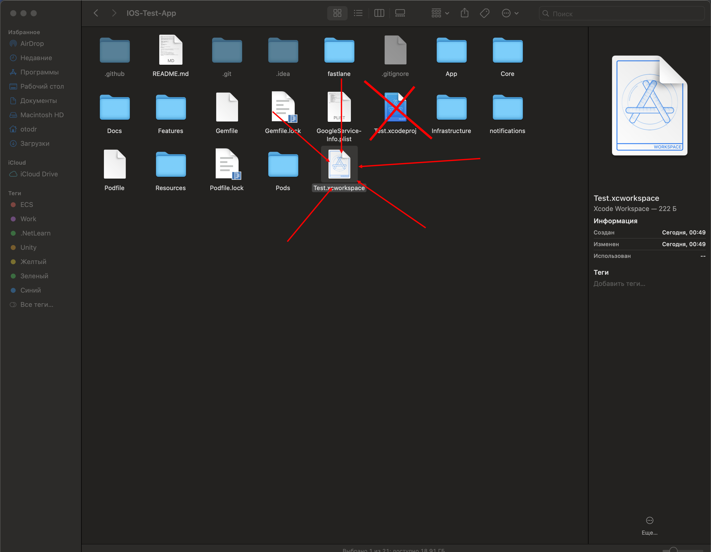

# Руководство по расширению проекта

Это пошаговое руководство описывает, как добавлять новый функционал в BaseProject вручную: без использования ИИ и без обязательного использования командной строки (кроме установки зависимостей). Все шаги можно выполнить в Xcode и проводнике (Finder).

---
1. Сделайте дубликат проекта и работайте в нем, либо создайте новую ветку в гите и запуште проект туда


## 1. Убедиться, что в проекте два таргета (основное приложение и Notification)

Перед расширением проекта проверьте, что в Xcode в навигаторе проекта (левая панель) в секции **TARGETS** отображаются **два таргета**:

1. **BaseProject** — основное приложение (иконка приложения).
2. **notifications** — расширение для уведомлений (иконка колокольчика).

Если одного из таргетов нет, добавьте его через File → New → Target… (например, Notification Service Extension для таргета notifications).



---

## 2. Signing: Team и Bundle Identifier (основное приложение и Notification)

Для сборки и установки приложения на устройство или отправки в App Store нужно настроить подпись (Signing) для **обоих** таргетов: указать **Team** и **Bundle Identifier**.

### Таргет BaseProject (основное приложение)

1. В левой панели Xcode выберите таргет **BaseProject** (в секции TARGETS).
2. Откройте вкладку **General**
3. В поле **Display Name** укажите отображаемое имя приложения
4. В поле **Bundle Identifier** укажите идентификатор приложения
5. Откройте вкладку **Signing & Capabilities**.
6. Включите **Automatically manage signing**.
7. В поле **Team** выберите вашу команду разработки (Apple Developer account).
8. В поле **Bundle Identifier** укажите идентификатор приложения (например, `com.yourcompany.yourapp`).




### Таргет notifications (расширение уведомлений)

1. В левой панели выберите таргет **notifications** (в секции TARGETS).
2. Откройте вкладку **Signing & Capabilities**.
3. Включите **Automatically manage signing**.
4. В поле **Team** выберите **ту же команду**, что и для BaseProject.
5. В поле **Bundle Identifier** укажите идентификатор расширения — он должен быть **поддоменом** основного приложения (например, `com.yourcompany.yourapp.notifications`).



Если после настройки Xcode показывает предупреждения о provisioning profile (например, «No profiles for '…' were found» или «Your team has no devices»), 
это нормально, ничего не делаем.
---

## 3. Переименование проекта и таргета

### Переименование названия проекта

1. В **Project Navigator** (левая панель) один раз кликни по иконке проекта (синяя иконка с именем, например BaseProject), чтобы выделить сам проект, а не таргет.
2. Справа в окне (Inspector) поменяй имя в поле **Name** в секции Identity and Type.
3. Xcode спросит: *"Rename project content items?"* — лучше выбрать **Rename**, чтобы заодно переименовались папка, схема и т.п.



### Переименование таргета

1. В **Project Navigator** в секции **TARGETS** выбери нужный таргет (например, BaseProject или notifications).
2. Один раз кликни по нему, затем ещё раз медленно кликни по имени (или нажми Enter) — имя станет редактируемым.
3. Введи новое имя и нажми **Enter**.

### Переименование Scheme

После переименования проекта (`.xcodeproj`) и/или таргета Xcode **не обновляет** файлы shared-схем автоматически. Локально Xcode находит таргет по UUID, поэтому проблема не видна, но на CI (fastlane `build_app`) схема ищется **по имени** — и билд падает с ошибкой:

```
Couldn't find specified scheme 'НовоеИмяТаргета'
Multiple schemes found but you haven't specified one.
```

Файлы схем находятся в `<Проект>.xcodeproj/xcshareddata/xcschemes/`.

**Порядок действий:**

1. Переименуйте файл схемы основного таргета — имя файла должно совпадать с новым именем таргета:

   ```
   СтароеИмя.xcscheme  →  НовоеИмяТаргета.xcscheme
   ```

2. Откройте переименованный файл в текстовом редакторе (это XML). Найдите все блоки `<BuildableReference>` и обновите в них три атрибута:

   | Атрибут | Было | Стало |
   |---------|------|-------|
   | `BuildableName` | `СтароеИмя.app` | `НовоеИмяТаргета.app` |
   | `BlueprintName` | `СтароеИмя` | `НовоеИмяТаргета` |
   | `ReferencedContainer` | `container:СтарыйПроект.xcodeproj` | `container:НовыйПроект.xcodeproj` |

   Пример фрагмента после замены:

   ```xml
   <BuildableReference
      BuildableIdentifier = "primary"
      BlueprintIdentifier = "C4251DD32EE193B600CD6F2C"
      BuildableName = "T_RosterVault.app"
      BlueprintName = "T_RosterVault"
      ReferencedContainer = "container:P_RosterVault.xcodeproj">
   </BuildableReference>
   ```

   `BlueprintIdentifier` (UUID) менять **не нужно** — он остаётся прежним.

3. Повторите шаг 2 для **всех остальных схем** в той же папке (например, `notifications.xcscheme`), которые ссылаются на основной таргет через `BuildableReference`.

4. Проверьте, что старых ссылок не осталось:

   ```bash
   grep -r "СтароеИмя" *.xcodeproj/xcshareddata/
   ```

   Команда не должна вернуть результатов.


### Синхронизация подов после переименования

После переименования проекта или таргета нужно обновить поды, чтобы sandbox совпадал с `Podfile.lock`:

1. Закройте проект
2. Откройте ваш проект `.xcodeproj` при помощи вашей IDE (не xcode)
3. Замените поле objectVersion = XX на objectVersion = 77, сохраните, закройте


4. Откройте терминал и перейдите в **корень проекта** (папка, где лежат `Podfile`, `Podfile.lock` и `.xcodeproj`).


5. Выполните **`bundle exec pod install`** (если в проекте используется Bundler; иначе — `pod install`).


6. После успешного завершения откройте в Xcode файл **`.xcworkspace`** (а не `.xcodeproj`) и соберите проект.




Это обязательный этап после переименования: без него сборка может завершиться с ошибкой *"The sandbox is not in sync with the Podfile.lock"* (подробнее см. [TROUBLESHOOTING.md](TROUBLESHOOTING.md)).

---

## 4. Где что лежит

| Что добавлять | Куда класть |
|---------------|-------------|
| Новая бизнес-сущность (модель данных) | `Features/<ИмяФичи>/Domain/Entities/` или `Core/Domain/Entities/` |
| Протокол репозитория или use case | `Features/<ИмяФичи>/Domain/` или `Core/Domain/` |
| Реализация репозитория, работа с сетью/БД | `Features/<ИмяФичи>/Data/` или `Core/Data/` |
| ViewModel и экраны (SwiftUI) | `Features/<ИмяФичи>/Presentation/` или `Core/Presentation/` |
| Регистрация зависимостей (DI) | `Infrastructure/DI/DependencyContainer.swift`, `App/AppDependencies.swift` |
| Конфигурация (URL, ключи) | `Infrastructure/Configuration/` (`StartupDefaultsConfiguration`, `AppConfiguration`) |

Правило: **Domain** не знает о UI и о конкретных реализациях. **Data** реализует протоколы из Domain. **Presentation** использует только протоколы (use cases, репозитории), которые передаются через контейнер зависимостей.

### 4.1. Заполнение полей в StartupDefaultsConfiguration

Параметры старта (URL сервера, идентификаторы магазина, Firebase, AppsFlyer и feature flags) задаются в **`Infrastructure/Configuration/StartupDefaultsConfiguration.swift`** — статические значения по умолчанию. `AppConfiguration` подставляет их, если в Bundle (Info.plist) нет переопределения (ключи `SERVER_URL`, `STORE_ID`, и т.д. можно задать в Build Settings при необходимости).

**Что заполнить (подставьте свои значения в соответствующие `static let`):**

| Свойство | Описание |
|----------|----------|
| `serverURL` | URL конфигурационного сервера (например, `https://your-server.com/config.php`) |
| `storeId` | Идентификатор приложения в App Store (числовой, без префикса `id`) |
| `firebaseProjectId` | Идентификатор проекта Firebase |
| `appsFlyerDevKey` | Dev Key из кабинета AppsFlyer |

Остальные булевы флаги в том же файле — для отладки и принудительных веток старта; в релизе обычно остаются `false`.

### 4.2. Замена GoogleService-Info.plist

В корне проекта лежит **`GoogleService-Info.plist`** — конфигурация Firebase (Cloud Messaging для push-уведомлений, Analytics и т.д.). 
В базовом репозитории он содержит данные примера; при создании своего приложения его нужно удалить этот и добавить ваш.

---

## 5. Пример: добавление фичи «Генератор паролей» (PasswordGenerator)

Ниже — полный цикл добавления фичи генератора и хранилища паролей: сущность, репозиторий, use case, три экрана. Экран **Generator** — слайдер длины 4–32, кастомные чекбоксы (цифры / заглавные / строчные / спецсимволы), тёмная тема с `gameBackground`, нажатие на пароль или кнопку Copy — копирование с индикатором «Copied»; экран **Save** — ввод имени и значения пароля, кнопка сохранения с индикатором «Saved!»; экран **Saved** — карточки паролей, копирование по нажатию, удаление кнопкой «X». Команды в терминале приведены только там, где без них не обойтись (установка подов); остальное делается в Xcode.

### Шаг 1. Создать папки для фичи

1. В Finder откройте корень проекта (там, где лежат папки `App`, `Core`, `Features`).
2. В папке `Features` создайте папку `PasswordGenerator`.
3. Внутри `PasswordGenerator` создайте папки: `Domain`, `Data`, `Presentation`.

В итоге структура должна быть такой:

```
Features/
  PasswordGenerator/
    Domain/       (здесь — протоколы и сущности)
    Data/         (здесь — реализация use case и репозитория)
    Presentation/ (здесь — ViewModels и экраны)
```

### Шаг 2. Domain: сущность и протоколы

1. В Xcode в навигаторе откройте `Features` → `PasswordGenerator` → `Domain`.
2. Создайте три файла (File → New → EmptyFile…):

**SavedPassword.swift** — сущность:

```swift
import Foundation

/// A named password entry persisted by the user.
struct SavedPassword: Identifiable, Codable, Equatable {
    let id: UUID
    let name: String
    let password: String
}
```

**GeneratePasswordUseCaseProtocol.swift** — протокол use case генерации:

```swift
import Foundation

/// Use case protocol: generate a random password with configurable character sets.
protocol GeneratePasswordUseCaseProtocol {
    func execute(length: Int, useDigits: Bool, useUppercase: Bool, useLowercase: Bool, useSpecialChars: Bool) -> String
}
```

**PasswordStorageRepositoryProtocol.swift** — протокол хранилища:

```swift
import Foundation

/// Contract for persisting and retrieving saved passwords.
protocol PasswordStorageRepositoryProtocol {
    func fetchAll() -> [SavedPassword]
    func save(_ entry: SavedPassword)
    func delete(id: UUID)
}
```

### Шаг 3. Data: реализация use case и репозитория

1. Путь: `Features/PasswordGenerator/Data/`.
2. Создайте два файла:

**GeneratePasswordUseCase.swift** — реализация генерации с поддержкой спецсимволов:

```swift
import Foundation

/// Generates a random password from the selected character sets.
final class GeneratePasswordUseCase: GeneratePasswordUseCaseProtocol {

    func execute(length: Int, useDigits: Bool, useUppercase: Bool, useLowercase: Bool, useSpecialChars: Bool) -> String {
        var charset = ""
        if useLowercase   { charset += "abcdefghijklmnopqrstuvwxyz" }
        if useUppercase    { charset += "ABCDEFGHIJKLMNOPQRSTUVWXYZ" }
        if useDigits       { charset += "0123456789" }
        if useSpecialChars { charset += "!@#$%^&*()-_=+[]{}|;:,.<>?" }

        // Fallback to lowercase if nothing is selected
        if charset.isEmpty { charset = "abcdefghijklmnopqrstuvwxyz" }

        return String((0..<length).compactMap { _ in charset.randomElement() })
    }
}
```

**PasswordStorageRepository.swift** — хранение через UserDefaults (JSON):

```swift
import Foundation

/// Persists saved passwords as JSON in UserDefaults.
final class PasswordStorageRepository: PasswordStorageRepositoryProtocol {

    private let defaults: UserDefaults
    private let storageKey = "saved_passwords"

    init(defaults: UserDefaults = .standard) {
        self.defaults = defaults
    }

    func fetchAll() -> [SavedPassword] {
        guard let data = defaults.data(forKey: storageKey) else { return [] }
        return (try? JSONDecoder().decode([SavedPassword].self, from: data)) ?? []
    }

    func save(_ entry: SavedPassword) {
        var list = fetchAll()
        list.append(entry)
        persist(list)
    }

    func delete(id: UUID) {
        var list = fetchAll()
        list.removeAll { $0.id == id }
        persist(list)
    }

    private func persist(_ list: [SavedPassword]) {
        if let data = try? JSONEncoder().encode(list) {
            defaults.set(data, forKey: storageKey)
        }
    }
}
```

### Шаг 4. Presentation: ViewModel и экраны

1. В `Features/PasswordGenerator/Presentation/` создайте `PasswordGeneratorViewModel.swift` — управляет генерацией и копированием в буфер обмена с индикатором «Copied» (без сохранения — оно на отдельном экране):

```swift
import Foundation
import UIKit

/// ViewModel for the password generator screen.
/// Manages generation options and clipboard copy with a brief "Copied" indicator.
@MainActor
final class PasswordGeneratorViewModel: ObservableObject {

    // MARK: - Published state

    @Published var generatedPassword: String = ""
    @Published var length: Double = 16
    @Published var useDigits: Bool = true
    @Published var useUppercase: Bool = true
    @Published var useLowercase: Bool = true
    @Published var useSpecialChars: Bool = false
    @Published private(set) var showCopied: Bool = false

    // MARK: - Dependencies

    private let generateUseCase: GeneratePasswordUseCaseProtocol

    // MARK: - Init

    init(generateUseCase: GeneratePasswordUseCaseProtocol) {
        self.generateUseCase = generateUseCase
    }

    // MARK: - Actions

    /// Generate a new random password using current options.
    func generate() {
        generatedPassword = generateUseCase.execute(
            length: Int(length),
            useDigits: useDigits,
            useUppercase: useUppercase,
            useLowercase: useLowercase,
            useSpecialChars: useSpecialChars
        )
    }

    /// Copy the current password to the system clipboard and show a brief fade-in / fade-out indicator.
    func copyToClipboard() {
        guard !generatedPassword.isEmpty else { return }
        UIPasteboard.general.string = generatedPassword
        showCopied = true
        Task {
            try? await Task.sleep(nanoseconds: 1_000_000_000)
            showCopied = false
        }
    }
}
```

2. Создайте `SavePasswordViewModel.swift` — ввод имени и пароля, сохранение с индикатором «Saved!»:

```swift
import Foundation

/// ViewModel for the save password screen.
/// Allows the user to enter a name and password value, then persist them.
@MainActor
final class SavePasswordViewModel: ObservableObject {

    // MARK: - Published state

    @Published var passwordName: String = ""
    @Published var passwordValue: String = ""
    @Published private(set) var showSaved: Bool = false

    // MARK: - Dependencies

    private let storageRepository: PasswordStorageRepositoryProtocol

    // MARK: - Init

    init(storageRepository: PasswordStorageRepositoryProtocol) {
        self.storageRepository = storageRepository
    }

    // MARK: - Actions

    /// Save the entered password with the given name to local storage.
    func save() {
        guard !passwordName.isEmpty, !passwordValue.isEmpty else { return }
        let entry = SavedPassword(id: UUID(), name: passwordName, password: passwordValue)
        storageRepository.save(entry)
        passwordName = ""
        passwordValue = ""
        showSaved = true
        Task {
            try? await Task.sleep(nanoseconds: 1_500_000_000)
            showSaved = false
        }
    }
}
```

3. Создайте `SavedPasswordsViewModel.swift` — список с удалением и копированием:

```swift
import Foundation
import UIKit

/// ViewModel for the saved passwords list screen.
@MainActor
final class SavedPasswordsViewModel: ObservableObject {

    // MARK: - Published state

    @Published private(set) var passwords: [SavedPassword] = []
    @Published private(set) var showCopied: Bool = false

    // MARK: - Dependencies

    private let storageRepository: PasswordStorageRepositoryProtocol

    // MARK: - Init

    init(storageRepository: PasswordStorageRepositoryProtocol) {
        self.storageRepository = storageRepository
    }

    // MARK: - Actions

    /// Reload the full list from storage.
    func load() {
        passwords = storageRepository.fetchAll()
    }

    /// Delete a saved password by id and refresh.
    func delete(id: UUID) {
        storageRepository.delete(id: id)
        passwords = storageRepository.fetchAll()
    }

    /// Copy a password string to the clipboard with a brief indicator.
    func copyPassword(_ value: String) {
        UIPasteboard.general.string = value
        showCopied = true
        Task {
            try? await Task.sleep(nanoseconds: 1_000_000_000)
            showCopied = false
        }
    }
}
```

4. Создайте SwiftUI-экран `PasswordGeneratorView.swift` — генератор с тёмной темой, `gameBackground`, секции в полупрозрачных подложках, кастомные чекбоксы и индикатор «Copied»:

```swift
import SwiftUI
import UIKit

/// Password generator screen with option toggles, length slider,
/// tap-to-copy and a brief "Copied" overlay.
struct PasswordGeneratorView: View {
    @StateObject private var viewModel: PasswordGeneratorViewModel

    init(viewModel: PasswordGeneratorViewModel) {
        _viewModel = StateObject(wrappedValue: viewModel)
    }

    var body: some View {
        ZStack {
            VStack(spacing: 16) {
                Spacer()
                passwordDisplay
                lengthSection
                optionsSection
                generateButton
                copyButton
                Spacer()
            }
            .padding(.horizontal, 32)
            .padding(.vertical, 16)

            copiedOverlay
        }
        .frame(maxWidth: .infinity, maxHeight: .infinity)
        .background(backgroundLayer.ignoresSafeArea())
    }

    // MARK: - Background

    private var backgroundLayer: some View {
        Group {
            if UIImage(named: "gameBackground") != nil {
                Image("gameBackground")
                    .resizable()
                    .scaledToFill()
            } else {
                Color(.systemGroupedBackground)
            }
        }
    }

    // MARK: - Password display

    private var passwordDisplay: some View {
        Text(viewModel.generatedPassword.isEmpty
             ? "Tap \"Generate\" to create a password"
             : viewModel.generatedPassword)
            .font(.system(.body, design: .monospaced))
            .foregroundColor(.white)
            .multilineTextAlignment(.center)
            .padding()
            .frame(maxWidth: .infinity)
            .background(Color.black.opacity(0.55))
            .cornerRadius(12)
            .contentShape(Rectangle())
            .onTapGesture {
                viewModel.copyToClipboard()
            }
    }

    // MARK: - Length slider

    private var lengthSection: some View {
        VStack(spacing: 8) {
            Text("Length: \(Int(viewModel.length))")
                .font(.subheadline.weight(.medium))
                .foregroundColor(.white)
            Slider(value: $viewModel.length, in: 4...32, step: 1)
                .tint(.accentColor)
        }
        .padding()
        .background(Color.black.opacity(0.55))
        .cornerRadius(12)
    }

    // MARK: - Options

    private var optionsSection: some View {
        VStack(spacing: 4) {
            OptionRow(title: "Digits", isOn: $viewModel.useDigits)
            OptionRow(title: "Uppercase", isOn: $viewModel.useUppercase)
            OptionRow(title: "Lowercase", isOn: $viewModel.useLowercase)
            OptionRow(title: "Special characters", isOn: $viewModel.useSpecialChars)
        }
        .padding()
        .frame(maxWidth: .infinity)
        .background(Color.black.opacity(0.55))
        .cornerRadius(12)
    }

    // MARK: - Generate button

    private var generateButton: some View {
        Button(action: { viewModel.generate() }) {
            Text("Generate")
                .font(.headline)
                .frame(maxWidth: .infinity)
                .padding()
                .background(Color.accentColor)
                .foregroundColor(.white)
                .cornerRadius(12)
        }
    }

    // MARK: - Copy button

    private var copyButton: some View {
        Button(action: { viewModel.copyToClipboard() }) {
            Text("Copy")
                .font(.headline)
                .frame(maxWidth: .infinity)
                .padding()
                .background(Color.green)
                .foregroundColor(.white)
                .cornerRadius(12)
        }
        .opacity(viewModel.generatedPassword.isEmpty ? 0.4 : 1)
        .disabled(viewModel.generatedPassword.isEmpty)
    }

    // MARK: - Copied overlay

    private var copiedOverlay: some View {
        Text("Copied")
            .font(.headline)
            .foregroundColor(.white)
            .padding(.horizontal, 24)
            .padding(.vertical, 12)
            .background(Color.black.opacity(0.75))
            .cornerRadius(10)
            .opacity(viewModel.showCopied ? 1 : 0)
            .animation(.easeInOut(duration: 0.4), value: viewModel.showCopied)
    }
}

// MARK: - Option row (custom checkbox built from basic shapes)

private struct OptionRow: View {
    let title: String
    @Binding var isOn: Bool

    var body: some View {
        Button {
            isOn.toggle()
        } label: {
            HStack(spacing: 12) {
                ZStack {
                    RoundedRectangle(cornerRadius: 4)
                        .stroke(Color.white, lineWidth: 2)
                        .frame(width: 24, height: 24)

                    if isOn {
                        RoundedRectangle(cornerRadius: 3)
                            .fill(Color.accentColor)
                            .frame(width: 18, height: 18)
                    }
                }

                Text(title)
                    .font(.system(size: 17))
                    .foregroundColor(.white)

                Spacer()
            }
            .frame(height: 44)
            .contentShape(Rectangle())
        }
        .buttonStyle(.plain)
    }
}
```

5. Создайте `SavePasswordView.swift` — экран сохранения пароля с полями имени и значения:

```swift
import SwiftUI
import UIKit

/// Screen for saving a password with a name and value.
struct SavePasswordView: View {
    @StateObject private var viewModel: SavePasswordViewModel

    init(viewModel: SavePasswordViewModel) {
        _viewModel = StateObject(wrappedValue: viewModel)
    }

    var body: some View {
        ZStack {
            VStack(spacing: 16) {
                Spacer()
                titleLabel
                nameField
                passwordField
                saveButton
                Spacer()
            }
            .padding(.horizontal, 32)
            .padding(.vertical, 16)

            savedOverlay
        }
        .frame(maxWidth: .infinity, maxHeight: .infinity)
        .background(backgroundLayer.ignoresSafeArea())
    }

    // MARK: - Background

    private var backgroundLayer: some View {
        Group {
            if UIImage(named: "gameBackground") != nil {
                Image("gameBackground")
                    .resizable()
                    .scaledToFill()
            } else {
                Color(.systemGroupedBackground)
            }
        }
    }

    // MARK: - Title

    private var titleLabel: some View {
        Text("Save a Password")
            .font(.title2.weight(.semibold))
            .foregroundColor(.white)
    }

    // MARK: - Name field

    private var nameField: some View {
        TextField("Password name", text: $viewModel.passwordName)
            .font(.system(size: 17))
            .foregroundColor(.white)
            .padding()
            .frame(maxWidth: .infinity)
            .background(Color.black.opacity(0.55))
            .cornerRadius(12)
    }

    // MARK: - Password field

    private var passwordField: some View {
        TextField("Password value", text: $viewModel.passwordValue)
            .font(.system(.body, design: .monospaced))
            .foregroundColor(.white)
            .padding()
            .frame(maxWidth: .infinity)
            .background(Color.black.opacity(0.55))
            .cornerRadius(12)
    }

    // MARK: - Save button

    private var saveButton: some View {
        Button(action: { viewModel.save() }) {
            Text("Save Password")
                .font(.headline)
                .frame(maxWidth: .infinity)
                .padding()
                .background(Color.green)
                .foregroundColor(.white)
                .cornerRadius(12)
        }
        .opacity(viewModel.passwordName.isEmpty || viewModel.passwordValue.isEmpty ? 0.4 : 1)
        .disabled(viewModel.passwordName.isEmpty || viewModel.passwordValue.isEmpty)
    }

    // MARK: - Saved overlay

    private var savedOverlay: some View {
        Text("Saved!")
            .font(.headline)
            .foregroundColor(.white)
            .padding(.horizontal, 24)
            .padding(.vertical, 12)
            .background(Color.black.opacity(0.75))
            .cornerRadius(10)
            .opacity(viewModel.showSaved ? 1 : 0)
            .animation(.easeInOut(duration: 0.4), value: viewModel.showSaved)
    }
}
```

6. Создайте `SavedPasswordsView.swift` — список сохранённых паролей с тёмной темой, карточками, копированием по нажатию и кнопкой удаления:

```swift
import SwiftUI
import UIKit

/// Screen that lists all saved passwords with copy-on-tap and delete.
struct SavedPasswordsView: View {
    @StateObject private var viewModel: SavedPasswordsViewModel

    init(viewModel: SavedPasswordsViewModel) {
        _viewModel = StateObject(wrappedValue: viewModel)
    }

    var body: some View {
        ZStack {
            VStack(spacing: 16) {
                if viewModel.passwords.isEmpty {
                    Spacer()
                    Text("No saved passwords yet")
                        .font(.headline)
                        .foregroundColor(.white.opacity(0.7))
                    Spacer()
                } else {
                    ScrollView {
                        VStack(spacing: 12) {
                            ForEach(viewModel.passwords) { entry in
                                passwordRow(entry)
                            }
                        }
                        .padding(.horizontal, 32)
                        .padding(.vertical, 24)
                    }
                    .scrollIndicators(.hidden)
                }
            }
            .frame(maxWidth: .infinity, maxHeight: .infinity)

            copiedOverlay
        }
        .frame(maxWidth: .infinity, maxHeight: .infinity)
        .background(backgroundLayer.ignoresSafeArea())
        .onAppear { viewModel.load() }
    }

    // MARK: - Background

    private var backgroundLayer: some View {
        Group {
            if UIImage(named: "gameBackground") != nil {
                Image("gameBackground")
                    .resizable()
                    .scaledToFill()
            } else {
                Color(.systemGroupedBackground)
            }
        }
    }

    // MARK: - Password row

    private func passwordRow(_ entry: SavedPassword) -> some View {
        HStack(spacing: 12) {
            VStack(alignment: .leading, spacing: 4) {
                Text(entry.name)
                    .font(.subheadline.weight(.semibold))
                    .foregroundColor(.white)
                Text(entry.password)
                    .font(.system(.caption, design: .monospaced))
                    .foregroundColor(.white.opacity(0.8))
            }

            Spacer()

            Button {
                viewModel.delete(id: entry.id)
            } label: {
                RoundedRectangle(cornerRadius: 4)
                    .fill(Color.red.opacity(0.8))
                    .frame(width: 32, height: 32)
                    .overlay(
                        Text("X")
                            .font(.system(size: 14, weight: .bold))
                            .foregroundColor(.white)
                    )
            }
            .buttonStyle(.plain)
        }
        .padding()
        .frame(maxWidth: .infinity, alignment: .leading)
        .background(Color.black.opacity(0.55))
        .cornerRadius(12)
        .contentShape(Rectangle())
        .onTapGesture {
            viewModel.copyPassword(entry.password)
        }
    }

    // MARK: - Copied overlay

    private var copiedOverlay: some View {
        Text("Copied")
            .font(.headline)
            .foregroundColor(.white)
            .padding(.horizontal, 24)
            .padding(.vertical, 12)
            .background(Color.black.opacity(0.75))
            .cornerRadius(10)
            .opacity(viewModel.showCopied ? 1 : 0)
            .animation(.easeInOut(duration: 0.4), value: viewModel.showCopied)
    }
}
```

### Шаг 4.1. Функционал экранов: копирование, сохранение и удаление

Во всех трёх экранах заложены действия с обратной связью:

- **Нажатие на пароль или кнопку Copy (Generator)** — сгенерированный пароль копируется в буфер обмена. Появляется полупрозрачный оверлей «Copied», который автоматически исчезает через 1 секунду. Реализация: `.onTapGesture { viewModel.copyToClipboard() }` на блоке с паролем и отдельная кнопка Copy. `UIPasteboard.general.string` для копирования. В начале файла нужен `import UIKit`.
- **Кнопка Save Password (Save)** — неактивна (opacity 0.4, disabled) если имя или значение пароля пустые. После сохранения поля очищаются и появляется оверлей «Saved!» на 1.5 секунды.
- **Нажатие на карточку пароля (Saved)** — значение пароля копируется в буфер обмена с аналогичным оверлеем «Copied». Реализация: `.onTapGesture { viewModel.copyPassword(entry.password) }` на карточке.
- **Нажатие на красную кнопку «X» (Saved)** — соответствующий пароль удаляется из хранилища, список обновляется. Реализация: `Button` с красным квадратом вызывает `viewModel.delete(id: entry.id)`.

### Шаг 5. DI: зарегистрировать зависимости и передать во View

1. Откройте `Infrastructure/DI/DependencyContainer.swift`.
2. В протокол `DependencyContainer` добавьте свойства:

```swift
var generatePasswordUseCase: GeneratePasswordUseCaseProtocol { get }
var passwordStorageRepository: PasswordStorageRepositoryProtocol { get }
```

3. В классе `DefaultDependencyContainer` добавьте те же поля и параметры инициализатора. В теле `init` присвойте оба свойства.

4. Откройте `App/AppDependencies.swift`.
5. В методе `makeDefaultContainer()` создайте зависимости и передайте в контейнер:

```swift
let generatePasswordUseCase = GeneratePasswordUseCase()
let passwordStorageRepository = PasswordStorageRepository()

return DefaultDependencyContainer(
    configuration: configuration,
    analyticsRepository: analyticsRepository,
    networkRepository: networkRepository,
    conversionDataRepository: conversionDataRepository,
    fcmTokenDataSource: fcmTokenLocalDataSource,
    initializeAppUseCase: initializeAppUseCase,
    pushTokenProvider: pushTokenProvider,
    logger: logger,
    logStorage: logStorage,
    generatePasswordUseCase: generatePasswordUseCase,
    passwordStorageRepository: passwordStorageRepository
)
```

### Шаг 6. Добавить экраны в навигацию

Если в приложении используется `MainTabView` или список вкладок:

1. Откройте файл, где объявляются вкладки (например, `Core/Presentation/Views/MainTabView.swift`).
2. Контейнер из `@Environment(\.dependencyContainer)` имеет тип `DependencyContainer?` — его нужно развернуть. Пример целиком:

```swift
import SwiftUI

/// Root view with three tabs: password generator, save password, and saved passwords list.
struct MainTabView: View {
    @Environment(\.dependencyContainer) private var container

    var body: some View {
        if let container {
            let generatorVM = PasswordGeneratorViewModel(
                generateUseCase: container.generatePasswordUseCase
            )
            let saveVM = SavePasswordViewModel(
                storageRepository: container.passwordStorageRepository
            )
            let savedVM = SavedPasswordsViewModel(
                storageRepository: container.passwordStorageRepository
            )

            TabView {
                PasswordGeneratorView(viewModel: generatorVM)
                    .tabItem {
                        Text("Generator")
                    }

                SavePasswordView(viewModel: saveVM)
                    .tabItem {
                        Text("Save")
                    }

                SavedPasswordsView(viewModel: savedVM)
                    .tabItem {
                        Text("Saved")
                    }
            }
        } else {
            EmptyView()
        }
    }
}
```

После сохранения файлов проект должен собираться. Запустите приложение и проверьте три экрана: генератор (слайдер 4–32, кастомные чекбоксы, тёмная тема с `gameBackground`, кнопки Generate и Copy); сохранение (ввод имени и пароля, кнопка Save Password с индикатором «Saved!»); список сохранённых паролей (карточки с названием и паролем, кнопка удаления «X», копирование по нажатию на карточку).

**Фон в нативном шелле (база):** в `RootView` для `AppState.native` показывается только `MainTabView()` — шаблон использует системный фон и **не** подключает ассет `gameBackground` (он для прохода дизайн/темы). В учебном примере ниже фон задаётся **внутри каждого таб-экрана** (ZStack + при необходимости `Image("gameBackground")`). Новые экраны с кастомным фоном делайте по той же схеме.


## Дебаг

В Infrastructure -> Configuration -> AppConfiguration

Есть параметры для дебага в том числе:
1. isDebug: Bool = false,
2. isGameOnly: Bool = true, -- Отображает только игровой режим
3. isWebOnly: Bool = false, -- Отображает только WebView режим
4. isNoNetwork: Bool = false, -- Отображает только экран No Network Connection
5. isAskNotifications: Bool = false, -- Отображает только экран запроса уведомлений
6. isInfinityLoading: Bool = false, -- Отображает только экран бесконечной загрузки

---

## 6. Добавление нового экрана без новой фичи

Если экран логически относится к уже существующей фиче (например, к WebView или AppInitialization):

- **ViewModel и View** можно положить в `Core/Presentation/` или в `Features/<СуществующаяФича>/Presentation/`.
- Зависимости (use case или репозиторий) берите из контейнера и передавайте во ViewModel в `init`. Не создавайте репозитории или use cases прямо во View.

---

## 7. Добавление нового Use Case

Use case — это сценарий использования (например, «сгенерировать пароль», «сохранить запись»). Обычно он инкапсулирует одну операцию и может использовать один или несколько репозиториев.

1. **Domain:** в подходящей фиче (например, `Features/PasswordGenerator/Domain/`) создайте протокол:

```swift
protocol GeneratePasswordUseCaseProtocol {
    func execute(length: Int, useDigits: Bool, useUppercase: Bool, useLowercase: Bool, useSpecialChars: Bool) -> String
}
```

2. **Data:** создайте класс, реализующий этот протокол:

```swift
final class GeneratePasswordUseCase: GeneratePasswordUseCaseProtocol {
    func execute(length: Int, useDigits: Bool, useUppercase: Bool, useLowercase: Bool, useSpecialChars: Bool) -> String {
        var charset = ""
        if useLowercase   { charset += "abcdefghijklmnopqrstuvwxyz" }
        if useUppercase    { charset += "ABCDEFGHIJKLMNOPQRSTUVWXYZ" }
        if useDigits       { charset += "0123456789" }
        if useSpecialChars { charset += "!@#$%^&*()-_=+[]{}|;:,.<>?" }
        if charset.isEmpty { charset = "abcdefghijklmnopqrstuvwxyz" }
        return String((0..<length).compactMap { _ in charset.randomElement() })
    }
}
```

3. **DI:** в `DependencyContainer` и `DefaultDependencyContainer` добавьте `var generatePasswordUseCase: GeneratePasswordUseCaseProtocol { get }`, создайте use case в `AppDependencies.makeDefaultContainer()` и передайте в контейнер.

4. **Presentation:** во ViewModel внедрите `GeneratePasswordUseCaseProtocol` и вызывайте `execute(...)`. Экран знает только о протоколе use case, а не о деталях генерации.

---

## 8. Структура папок (кратко)

- **App** — точка входа, AppDelegate, сборка DI.
- **Core** — общий Domain, Data, Presentation (то, что не привязано к одной фиче).
- **Features/<ИмяФичи>** — Domain (сущности, протоколы), Data (реализации), Presentation (ViewModel, Views).
- **Infrastructure** — конфигурация, DI, логирование.
- **Resources** — ассеты, Preview Content.

Новые Swift-файлы, созданные в этих папках, должны быть добавлены в основной app target (и при необходимости в таргет расширения, если код используется там). При использовании File System Synchronized Groups файлы под папками `App`, `Core`, `Features`, `Infrastructure`, `Resources` подхватываются автоматически.

---

## 9. Частые моменты

- **«Cannot find type X in scope»** — проверьте, что файл с типом входит в тот же таргет, что и файл, который его использует.
- **Циклические зависимости** — Domain не должен импортировать Data или Presentation. Data не должен импортировать Presentation.
- **Тесты** — для тестирования ViewModel создайте мок-реализацию протокола репозитория или use case и передайте её во ViewModel; для тестирования всего приложения можно подменить контейнер через `AppDependencies.setContainerForTesting(_:)` до запуска UI.

Более общее описание слоёв и правил зависимостей — в [ARCHITECTURE.md](ARCHITECTURE.md).
